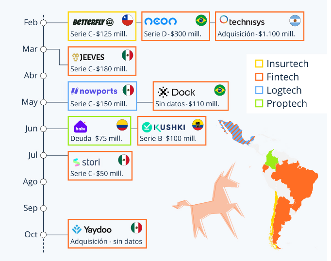

# anotaciones_TPI

------- Clase 16082023 ------------

- Presencial los miercoles y virtual los sabados (casi siempre)
- Equipos asignado un tutor en tiempo real con un proyecto 
- inicio 16 de agosto 
- fin 2 de diciembre 

 - IA: TensorFlor.org <->  OpenCV

#herramientas#
- Microsoft teams  -> ir por este para los meets . Se deben subir los documentos oficiales entregar en .docx 
- Miel 

-Innovacion: 
    - Tiene que ser innovador y algo nuevo. En caso de existir en el mercado debe ser algo que se puede dar vuelta el mercado con eso nuevo 
    - en caso de no haber cohesion siempre se habla 
    - Esta dividido en MVP4 
    - Ir a fuentes primarias 
    - La idea es un disprubcion nueva que cambie la modelo de negocio 
    - La propuesta de valor lo que dice o muestra que elige el cliente a nosotros y no a la competencia
    - la tecnologia avanza a pasos agigantados 
    - Pensar en la MARCA y la identidad 
    - Agilizar los caminos criticos 
    - La idea es de trabajar en prototipos (utilizar reptropestiva de mercado) 
    - manejo de identidad marcaria. Verificar las tonalidades 
    - valor = (comocimiento + habilidad ) * actitud -> depende de las gnas que hacer . LA negociacion es importante 
    - 

- Ideas de 

-   
-   armar los grupos
-   armar el projecto de github y el proyecto 
-   los mvp son grupales y es con nota 
-   producto, marca, diseño, metodolodgia, codigo fuente 

- Avances 
- propuesta de idea
- uder history mapping
- lean canvas
- productor backlog/sprint balcklog
- diseño de pantallas
- marca-templates
- landing page
- arquitectura de la aplicacion
- elevator de ventas
- presentacion comercial
- manual de usuario
- funcionalidades y especificaciones
- manual de implementacion y configuracion
- codigo fuente 

MVP1: maqueta
MVP2: entrega parcial
MVP3: entrega parcial
MVP4: entrega final
Expo proyecto: 25-26-27 de octubre aprox

Entrega final 22 de noviembre 
- entrega de archivos
- propuesta formal
- presentacion comercial
- informe tecnico 
- app funcionando 

- Mantener al menos dos tipos de ambientes (des-testing)

    
    Clase 01 introduccion 1 .1 ppt 

